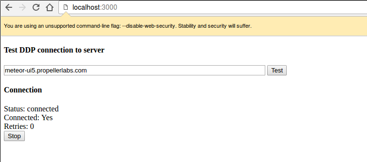

# Meteor Test Connect
Small utility for testing a DDP connection to a Meteor server.

## Instructions
1. Clone repo
2. Run `meteor` from project directory.
3. Open [http://localhost:3000](http://localhost:3000) in your browser.

May require running your browser in insecure mode (check JS console for CORS errors).

## Screenshot
